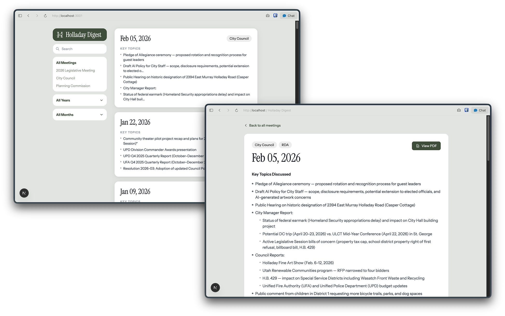

# Holladay Hub

A tool for browsing Holladay City meeting minutes with AI-generated summaries.

The scraper pulls meeting PDFs from the city's website, extracts the text, and uses Claude to generate structured summaries. The Next.js app lets you browse, filter, and search those summaries in a clean dashboard.



## Features

- Browse City Council and Planning Commission meeting minutes
- Filter by meeting type, year, and month
- Search across all summaries
- AI-generated structured summaries with key topics, decisions, and votes
- Links to original PDF for each meeting

## Stack

- **Scraper** — Python, pdfplumber, Anthropic Claude API
- **Web app** — Next.js 15, Tailwind CSS, better-sqlite3
- **Storage** — SQLite (`meeting_summaries.db`)

## Setup

### 1. Scraper

Install dependencies:
```bash
pip3 install anthropic pdfplumber requests beautifulsoup4
```

Set your Anthropic API key:
```bash
export ANTHROPIC_API_KEY="sk-ant-..."
```

Run the scraper:
```bash
python3 scraper.py
```

The scraper fetches meeting PDFs from 2020 onwards, extracts text, and summarizes each one with Claude. It skips PDFs already processed so it's safe to re-run.

### 2. Web App

```bash
cd next-app
npm install
npm run dev
```

Visit [http://localhost:3001](http://localhost:3001).

## Project Structure

```
HolladayHub/
├── scraper.py              # Scrapes PDFs, summarizes with Claude, saves to SQLite
├── meeting_summaries.db    # SQLite database (git-ignored)
├── pdfs/                   # Downloaded PDFs (git-ignored)
└── next-app/
    ├── app/
    │   ├── page.tsx                  # Dashboard
    │   ├── meetings/[id]/page.tsx    # Meeting detail
    │   └── api/meetings/route.ts     # Meetings API
    ├── components/
    │   ├── MeetingCard.tsx
    │   ├── Sidebar.tsx
    │   └── SearchBar.tsx
    └── lib/
        ├── db.ts                     # SQLite queries
        └── meetingColors.ts          # Type colors and labels
```

## Notes

- Only City Council and Planning Commission meetings have minutes PDFs on the city website. Other meeting types (Arts Council, Tree Committee, etc.) only publish agendas.
- The scraper uses Python 3.14+ (Homebrew) due to SSL compatibility issues with macOS's built-in Python 3.9.
